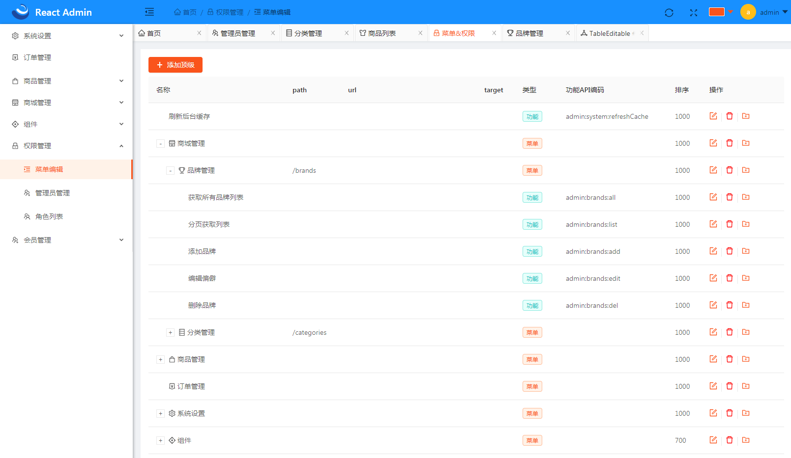
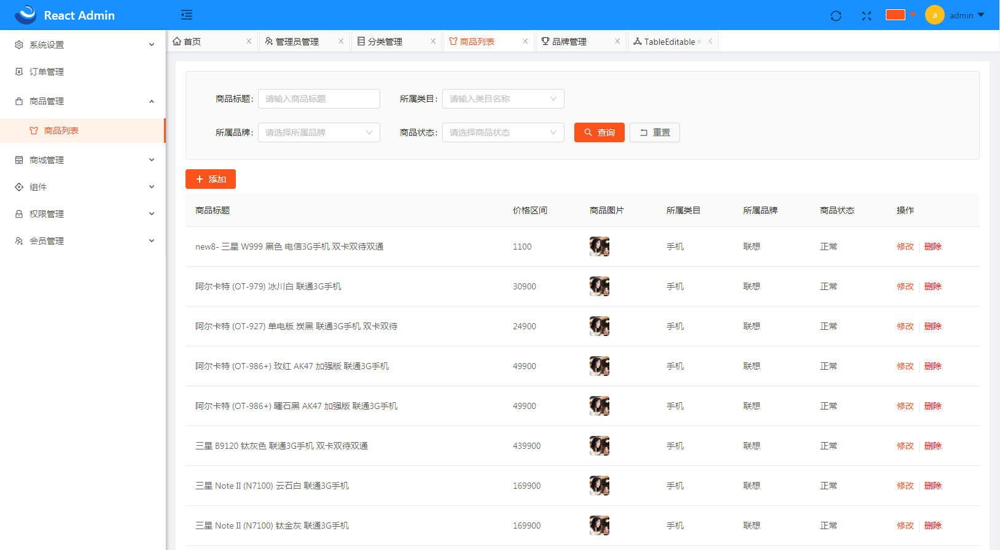
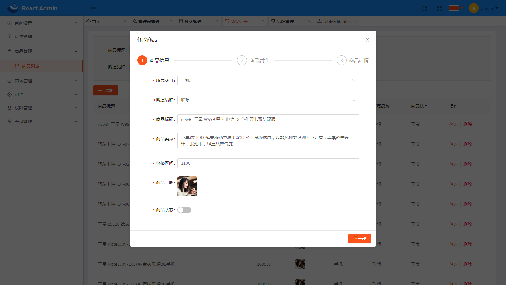
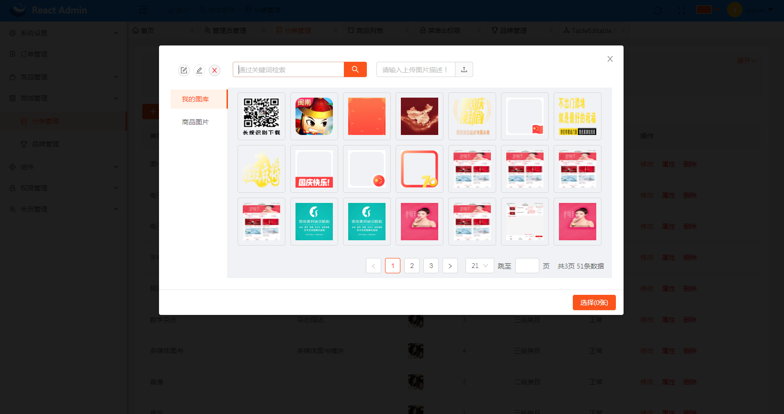
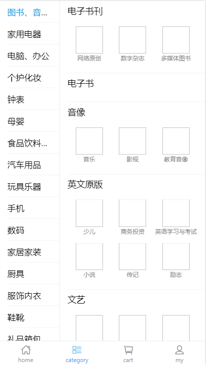
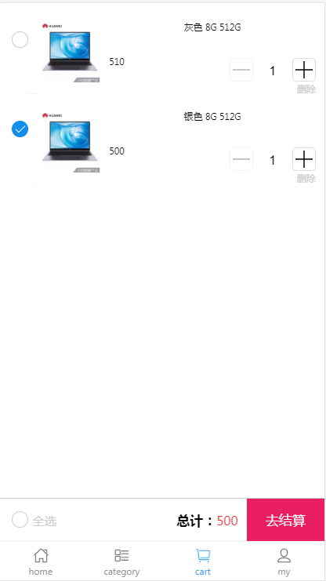
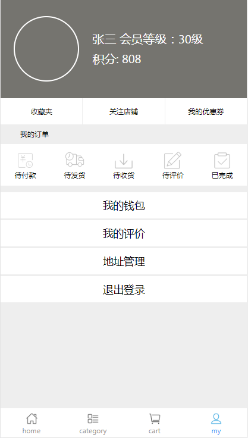
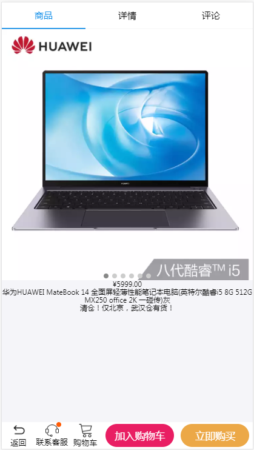

# SpringReactShop

#### 介绍
一个简单的、简陋的在线商城、管理系统

- 后端采用springboot+mybatis
- 后台管理使用react+antd
- 商城使用react+antd-mobile

[springboot后端查看具体介绍](./shop-spring/README.md)

[admin管理查看具体介绍](./shop-admin-react/README.md)

[配商城端ReactShop](https://gitee.com/zhuyunlong2018/ReactShop)

#### 部分截图

#### 参与贡献

1. Fork 本仓库
2. 新建 Feat_xxx 分支
3. 提交代码
4. 新建 Pull Request

#### 题外话
- 业余开发实在是进度龟速，有兴趣的朋友可以一起开发啊……
- 请联系920200256@qq.com